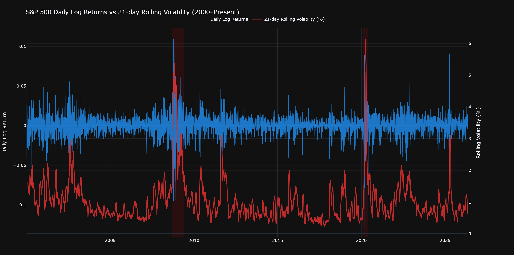

<p align="center">
  
</p>

# S&P 500 Market Intelligence System

**Financial market intelligence built with data science**

An end-to-end financial data science project focused on understanding market behaviour, quantifying risk, and building a foundation for forecasting models using S&P 500 data.

This project is not only about prediction. It is about building statistical understanding first, then modelling.

---

## 🎯 Project Objective

Financial time series are structurally different from most datasets: they are noisy, non-stationary, and dominated by regime changes and extreme events.

This system is built to reflect a realistic analytical workflow:

**data validation → statistical diagnostics → feature engineering → forecasting → evaluation**

The emphasis is on building a reliable foundation before applying models.

It combines two perspectives:
- Market behaviour and risk diagnostics
- Forecasting and anomaly detection

---

## 📊 Key Findings (Phases 1–2)

### Data Quality & Structure
- A single **zero-volume observation (2023-05-24)** was identified in a valid trading period
- Cross-checked against US market calendar (not a holiday)
- Classified as a **data provider inconsistency (yfinance)**
- Removed to avoid bias in returns and volatility estimates

This reinforces an important principle: external financial data must be validated, not assumed correct.

---

### Stationarity & Time-Series Structure
- Log returns are **stationary**
  - ADF Statistic: **-19.60**
  - p-value: **< 0.001**
- Raw prices are non-stationary and contain a unit root

This confirms that modelling should be performed on returns rather than prices.

---

### Distributional Behaviour
- Skewness: **-0.3479**
- Excess Kurtosis: **10.6424**
- Strong evidence of:
  - fat tails
  - non-normality
  - frequent extreme outcomes

This is confirmed by normality testing (Jarque-Bera rejection).

---

### Volatility Structure
- Strong **volatility clustering** observed in squared returns
- Significant autocorrelation in volatility proxies (squared / absolute returns)
- Weak autocorrelation in raw returns

This suggests:
> return direction is weakly predictable, but volatility is structured and persistent

---

### Risk Characteristics
- Maximum historical drawdown: **-56.78% (2009-03-09)**
- Severe tail events dominate long-term risk profile
- Evidence of asymmetric downside risk

---

### Calendar Effects
- Weakest month: **September**
- Stronger average returns observed in **Q4 months (notably November)**
- Weak but observable day-of-week structure

These effects are not strong enough for standalone signals, but useful as contextual features.

---

## 📂 Notebook Structure

| #  | Notebook | Status | Focus |
|----|----------|--------|-------|
| 01 | EDA & Data Preparation | ✅ Completed | Data validation, returns, drawdowns, seasonality |
| 02 | Statistical Diagnostics | 🟡 In Progress | ACF/PACF, normality tests, volatility structure |
| 03 | Feature Engineering | ⏳ Planned | Lags, indicators, regime features |
| 04 | Classical Forecasting | ⏳ Planned | ARIMA, SARIMA, Prophet |
| 05 | Volatility Modelling | ⏳ Planned | GARCH family, VaR |
| 06 | Deep Learning Forecasting | ⏳ Planned | LSTM, GRU |
| 07 | Anomaly Detection | ⏳ Planned | Isolation Forest, autoencoders |
| 08 | Model Evaluation | ⏳ Planned | Backtesting and performance comparison |

---

## 🛠 Tech Stack

**Data Processing**
- Python 3.11
- pandas, NumPy
- yfinance

**Statistical Analysis**
- statsmodels
- scipy

**Visualisation**
- Plotly (primary)
- Matplotlib

**Forecasting (Planned)**
- ARIMA / SARIMA / Prophet
- GARCH family models
- TensorFlow / Keras (LSTM, GRU)
- scikit-learn

**Environment**
- Conda-based reproducible environment (`environment.yml`)

---

## 📁 Repository Structure

```text
sp500-market-intelligence/
├── data/                        # Cleaned datasets (CSV + Parquet)
├── notebooks/
│   ├── 01_eda.ipynb
│   ├── 02_statistical_diagnostics.ipynb
│   └── ...
├── reports/
│   └── figures/                 # Exported visualisations
├── environment.yml
├── README.md                         # Future reusable modules
Next phase:

➡️ Feature Engineering & Forecasting Pipeline

---

## Project Workflow

```text
Raw Market Data
        ↓
Data Validation & Cleaning
        ↓
EDA & Statistical Diagnostics
        ↓
Feature Engineering
        ↓
Classical Forecasting
        ↓
Volatility Modelling
        ↓
Deep Learning
        ↓
Anomaly & Regime Detection
        ↓
Model Evaluation
```

---

## Notebook Structure

| # | Notebook | Description |
|---|---|---|
| **01** | [`01_eda.ipynb`](01_eda.ipynb) | **EDA, Data Integrity & Financial Foundations**<br>Data loading, OHLCV interpretation, datetime pipeline, zero-volume validation, log returns, stationarity, volatility, drawdowns, seasonality |
| **02** | [`02_statistical_diagnostics.ipynb`](02_statistical_diagnostics.ipynb) | **Statistical Diagnostics & Stylized Facts**<br>Distribution analysis, skewness/kurtosis, Q-Q plots, Jarque-Bera, ACF/PACF, Ljung-Box, ARCH effects, white-noise testing |
| **03** | [`03_feature_engineering.ipynb`](03_feature_engineering.ipynb) | **Feature Engineering & Technical Indicators**<br>Rolling statistics, lag features, RSI, MACD, ATR, Bollinger Bands, calendar effects, regime indicators |
| **04** | [`04_classical_forecasting.ipynb`](04_classical_forecasting.ipynb) | **Classical Forecasting**<br>ARIMA/SARIMA family, Prophet, baseline models, walk-forward validation |
| **05** | [`05_garch_volatility_modeling.ipynb`](05_garch_volatility_modeling.ipynb) | **Volatility Modelling**<br>ARCH/GARCH, EGARCH, GJR-GARCH, conditional volatility, VaR |
| **06** | [`06_deep_learning.ipynb`](06_deep_learning.ipynb) | **Deep Learning Forecasting**<br>LSTM, GRU, sequence modelling, multi-step prediction |
| **07** | [`07_anomaly_detection.ipynb`](07_anomaly_detection.ipynb) | **Anomaly & Regime Detection**<br>Isolation Forest, Autoencoders, extreme-event detection, market regimes |
| **08** | [`08_model_evaluation.ipynb`](08_model_evaluation.ipynb) | **Evaluation & Comparison**<br>RMSE, MAE, directional accuracy, residual diagnostics, backtesting |

---

## Repository Structure

```text
sp500-market-intelligence/
│
├── notebooks/
├── data/
│   ├── raw/
│   └── processed/
├── reports/
│   └── figures/
├── environment.yml
└── README.md
```

---

## Tech Stack

### Core
- Python 3.11
- pandas
- NumPy
- yfinance

### Visualisation
- Plotly
- Matplotlib / Seaborn

### Statistical & Forecasting
- statsmodels
- pmdarima
- Prophet
- arch

### Machine Learning
- scikit-learn
- TensorFlow / Keras

### Environment
- Conda (`environment.yml`)
- reproducible notebook workflow

---

## How to Run

```bash
# Clone repository
git clone https://github.com/Mena-Beshara/sp500-market-intelligence.git

cd sp500-market-intelligence

# Create environment
conda env create -f environment.yml
conda activate sp500-intel

# Launch notebooks
jupyter lab
```

---

## Project Status

**Active Development**  
Currently progressing through:

✅ EDA & Statistical Validation  
🔄 Feature Engineering  
⏳ Forecasting & Volatility Modelling  
⏳ Deep Learning & Regime Detection

---

## Author

**Mena Beshara**  
Telecommunications Engineer transitioning into Data Science & Quantitative Finance.

Building reproducible financial systems with a focus on statistical validation, risk analysis, and explainable modelling.
