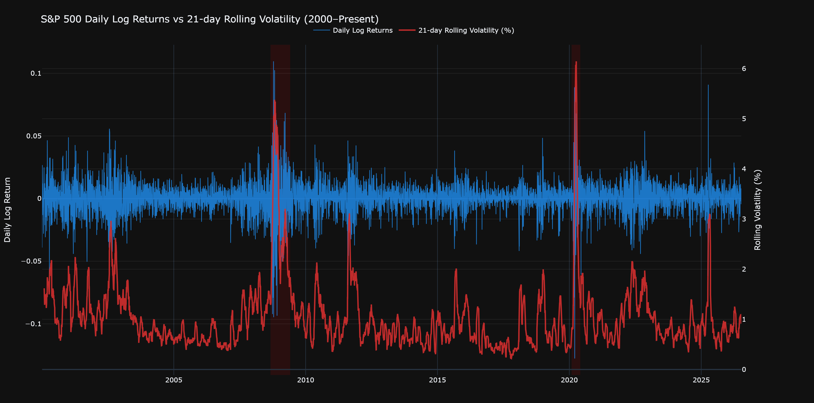

# S&P 500 Market Intelligence System

A quantitative decision-support system designed to support systematic long-term investing.

The project transforms historical and live S&P 500 market data into a structured daily Market Risk Report that helps evaluate portfolio risk before new capital is allocated. Rather than predicting market direction or generating trading signals, the system estimates market conditions through statistical analysis, volatility forecasting and market regime classification.

The objective is to replace intuition with a repeatable, evidence-based investment process.

---

## The problem

Financial markets are noisy, non-linear and difficult to predict.

Classical forecasting techniques often perform no better than simple benchmarks when applied to daily returns, yet market volatility exhibits persistent statistical structure through clustering and changing regimes.

This project asks a different question.

> **Can historical market data be transformed into interpretable risk information that supports a repeatable investment decision process?**

Rather than attempting to predict direction, the project focuses on estimating uncertainty.

---

## The system

```text
Historical Market Data
          │
          ▼
Data Validation
          │
          ▼
Statistical Diagnostics
          │
          ▼
Feature Engineering
          │
          ▼
Volatility Forecasting
          │
          ▼
Market Regime Classification
          │
          ▼
Risk Intelligence
          │
          ▼
Daily Market Risk Report
          │
          ▼
Decision Log
```

Every stage contributes to a single objective: producing a transparent, evidence-based assessment of current market risk.

---

## Daily Market Risk Report

```text
-------------------------------------------------
S&P 500 Market Risk Report
-------------------------------------------------

Date:                  2026-07-01

Forecast volatility:   23.8% annualised
Historical percentile: 89th
Market regime:         Stress
95% Value at Risk:     -2.1%
Anomaly detected:      No

Risk summary

Market volatility remains elevated relative to
recent history. Although current conditions fall
within the historical distribution, continued
portfolio monitoring is recommended before the
next trading session.

Decision logged.

-------------------------------------------------
```

The report deliberately separates model outputs from investment decisions.

The model estimates market conditions.

The investor remains responsible for every portfolio decision.

---

## Current capabilities

### Data engineering

* Download historical S&P 500 market data
* Validate data quality before analysis
* Detect missing observations and duplicates
* Verify trading calendar consistency
* Export validated datasets for downstream modelling

### Statistical analysis

* Stationarity testing
* Distribution analysis
* Fat-tail analysis
* Volatility clustering diagnostics
* Drawdown analysis
* Correlation structure
* Risk metric calculation

### Feature engineering

* Log returns
* Rolling volatility
* Lagged features
* Momentum features
* Calendar variables
* Bias-free feature construction

### Forecasting

* Historical Mean benchmark
* ARIMA evaluation
* SARIMA evaluation
* Prophet evaluation
* Walk-forward validation

### Volatility modelling

* Realised volatility target construction
* Naive persistence benchmark
* ARCH and GARCH estimation under Normal and Student's t innovations
* Asymmetric volatility response via GJR-GARCH
* Model selection by information criteria
* Walk-forward evaluation with scheduled refits
* Residual diagnostics on standardised residuals
* Volatility persistence and half-life interpretation

### Market regime classification

* Percentile-based regimes: Calm, Normal, Stress, Crisis
* Historical validation against the 2020 COVID crash and the 2022 rate-hike period
* Plain-language risk signal generation
* Risk intelligence summary in both conditional volatility and expected daily move units

### Risk intelligence (planned)

* Daily Market Risk Report generation
* Anomaly alert integration
* Decision logging
* Portfolio monitoring metrics

---

## Research findings

The direction forecasting stage produced one result that shaped the rest of the system.

Forecasting market direction using ARIMA, SARIMA and Prophet did not outperform a simple Historical Mean benchmark under walk-forward evaluation.

Rather than introducing additional model complexity without evidential justification, the project shifted its modelling effort toward volatility forecasting, where the statistical diagnostics demonstrated persistent structure through conditional heteroskedasticity.

The project now estimates market risk rather than predicting returns.

The volatility stage put that decision to work. Conditional heteroskedasticity, first identified in the statistical diagnostics, was reconfirmed on the modelling sample before any model was fitted. GARCH-family models were then built as a controlled ladder — ARCH(1), GARCH(1,1) under Normal and Student's t innovations, then GJR-GARCH — with each step changing exactly one assumption so any improvement is attributable to a specific modelling choice. Heavy-tailed innovations follow directly from the fat-tail diagnostics, and the asymmetric specification tests whether volatility responds more strongly to negative shocks, the leverage effect implied by the negative skew of daily returns.

Model selection is handled by information criteria through a winner-selection registry, so the regime classifier, risk signal and summary always inherit the best-supported specification rather than a hardcoded choice. Every volatility model is evaluated out of sample against a naive persistence benchmark under walk-forward validation, and the regime classifier is checked against two known stress periods: the 2020 COVID crash and the 2022 rate-hike year.

---

## Research workflow

| Stage                    | Objective                        | Status |
| ------------------------ | -------------------------------- | :----: |
| Data validation          | Validate raw market data         |   ✅   |
| Statistical diagnostics  | Characterise return behaviour    |   ✅   |
| Feature engineering      | Create forecasting features      |   ✅   |
| Direction forecasting    | Evaluate predictive edge         |   ✅   |
| Volatility modelling     | Forecast conditional volatility  |   ✅   |
| Deep learning comparison | Compare against GARCH            |   📋   |
| Anomaly detection        | Detect structural market changes |   📋   |
| Risk intelligence        | Generate Market Risk Report      |   📋   |

---

## Methodology

* Data quality is verified before modelling.
* Look-ahead bias is explicitly prevented.
* Walk-forward validation is preferred over random train-test splits.
* Simpler models are preferred unless additional complexity improves out-of-sample performance.
* Every modelling decision is supported by statistical evidence.
* Every stage is reproducible and suitable for technical review.

---

## Technology stack

### Languages

* Python 3.11

### Data

* pandas
* NumPy
* Parquet
* yfinance

### Statistical modelling

* statsmodels
* SciPy
* arch

### Visualisation

* Plotly

### Development

* Jupyter Notebook
* Conda
* environment.yml

---

## Repository structure

```text
sp500-market-intelligence-system/

│
├── notebooks/
│   ├── 01_eda.ipynb
│   ├── 02_statistical_diagnostics.ipynb
│   ├── 03_feature_engineering.ipynb
│   ├── 04_Baseline_Forecasting_Models.ipynb
│   └── 05_volatility_forecasting_garch.ipynb
│
├── data/
│   ├── sp500_cleaned.csv
│   ├── sp500_cleaned.parquet
│   ├── sp500_eda_enriched.csv
│   ├── sp500_eda_enriched.parquet
│   └── sp500_features.parquet
│
├── reports/
│   └── figures/
│
├── environment.yml
│
└── README.md
```

The repository currently focuses on the research phase. Notebooks 06 to 08 (deep learning comparison, anomaly detection, risk intelligence) are scheduled next and will be added under `notebooks/` as they are completed. Once the analytical work is complete, the notebooks will be modularised into a production-ready Python package.

---

## Production roadmap

### Research phase

* ✅ Data validation
* ✅ Statistical diagnostics
* ✅ Feature engineering
* ✅ Direction forecasting
* ✅ Volatility forecasting
* 📋 Deep learning comparison
* 📋 Anomaly detection
* 📋 Risk intelligence system

### Production phase

* Modular `src` package
* Daily report generation
* Unit testing
* Model Card
* Automated execution
* Configuration management

---

## Known limitations

The system estimates market risk rather than market direction.

Forecasts are derived from historical observations and cannot anticipate unforeseen macroeconomic or geopolitical events.

Market regime thresholds are percentile-based and may require recalibration as market structure evolves.

Realised volatility is an observable proxy for latent volatility, so forecast evaluation inherits the measurement noise of that proxy.

The current implementation is designed around SPY as a representative long-term equity position and should not be assumed to generalise to other asset classes without additional validation.

The project produces decision-support information only. It does not generate trading signals or investment advice.

---

## Why this project

Many market forecasting projects stop once a prediction has been generated.

This project continues one step further.

It investigates whether statistical models can support a disciplined investment process rather than simply producing forecasts. Every model output feeds into a structured Market Risk Report, every investment decision is logged separately from the model output, and the framework can be evaluated retrospectively to determine whether the decision process improves consistency over time.

The emphasis is not on predicting the future. It is on building a transparent, repeatable and auditable decision-support system for long-term investing.

It also demonstrates a complete quantitative workflow:

* validating financial data,
* performing statistical diagnostics,
* engineering forecasting features,
* evaluating competing models,
* selecting models based on evidence,
* translating model outputs into business decisions.

---

## License

This repository is intended for educational and portfolio purposes.

Nothing in this repository constitutes financial or investment advice. The Market Intelligence System provides quantitative decision-support information only, and all investment decisions remain the responsibility of the investor.