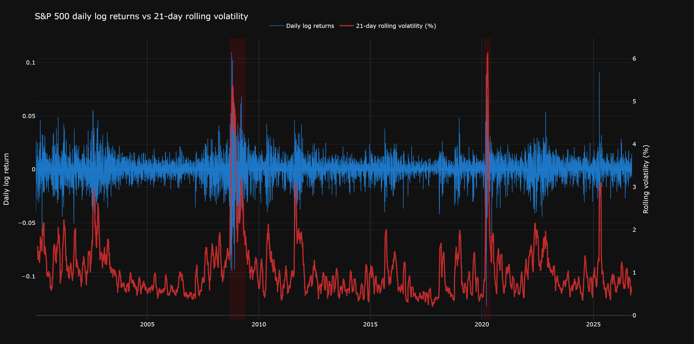
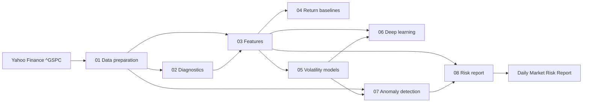

*Daily S&P 500 log returns with 21-day rolling volatility. The shaded bands mark the 2008 financial crisis and the 2020 COVID crash. Calm and turbulent periods cluster, which is why this system forecasts volatility rather than direction.*

# S&P 500 Market Intelligence System

*A quantitative decision-support system for S&P 500 market risk.*

The system exists to answer one question each week: given everything it knows today, what should I review before this week's allocation decision? It forecasts next-day volatility with a GJR-GARCH model, classifies the volatility regime, flags days the model did not expect, and combines all three in a Daily Market Risk Report that also tests its own forecasts against what happened. The report informs the decision. It does not make it, and the system produces no buy or sell signals.

The work runs across eight sequential Jupyter notebooks with walk-forward evaluation. Every statistic in this README comes from the run on data as of 2026-09-25 and traces to `data/locked_metrics.json` or to an executed output in [`docs/`](docs/).

## Project snapshot

| Item | Detail |
|---|---|
| Asset | S&P 500 index (`^GSPC`), daily prices and volume from Yahoo Finance |
| Sample | 2000-01-03 to 2026-09-25: 6,721 daily log returns, and a 6,441-row modelling frame from 2001-02-13 after feature warm-up |
| Forecast target | Next-day volatility, scored against the absolute daily log return |
| Production model | GJR-GARCH(1,1,1) with Student's t innovations, selected by AIC |
| Evaluation | Walk-forward over the final 252 trading days, refit every 21 days on an expanding window |
| Status | All eight notebooks executed. The production model fails its own VaR backtest, and a fix is in progress |

## Current status

All eight notebooks have run in sequence on data as of 2026-09-25, and the system's own monitoring has flagged its production model. The parametric VaR fails the Kupiec backtest at both the 95% and 99% levels, so the monitoring status is BREACH, and under the project's stay-in-service rule a single BREACH pulls the model for investigation. The evidence suggests the symmetric Student's t understates the left tail: **87.5%** of the anomaly flags in NB07 are falls.

The fix is in progress. The next release adds GJR-GARCH(1,1,1) with skewed Student's t innovations as a fifth candidate in NB05's AIC comparison, so any change of model follows the project's existing selection rule, and NB06 to NB08 will consume whichever specification NB05 selects. The next release also corrects the EWMA benchmark comparison. The current one scores the EWMA forecast as a raw standard deviation and the GARCH forecast as an expected absolute return, so I have left that comparison out of this README until the corrected version is published. Until then, every figure below describes the symmetric Student's t release.

## What the system produces

NB08 refits the production model selected in NB05, classifies the regime, adds the anomaly flag from NB07 and assembles the Daily Market Risk Report, which it exports to [`reports/risk_report.json`](reports/risk_report.json). This excerpt is the report as of 2026-09-25:

```text
Daily Market Risk Report, as of 2026-09-25 (excerpt)

Model                   GJR-GARCH(1,1,1), Student's t
Next-day volatility     0.6446% daily, 10.23% annualised
Historical percentile   25th
Regime                  Calm, less than 0.01 percentage points below the Normal threshold
Trend                   falling against 1 week ago and 1 month ago
Daily VaR               0.9772% at 95%, 1.5847% at 99%
Anomaly detected        No
VaR backtest            rejected at 95% and at 99%
Monitoring status       BREACH
Allocation multiplier   1.0x (Calm)
```

The full report also splits the forecast into its GARCH terms and carries the calibration and monitoring checks. The weekly contribution is sized by the regime observed on the previous Friday, so the signal never uses the week it sizes. The investor also records the intended contribution in a decision log before opening the report, which makes the gap between intention and action measurable.

## How the pipeline fits together


```mermaid
flowchart LR
    Y["Yahoo Finance ^GSPC"] --> N01["01 Data preparation"]
    N01 --> N02["02 Diagnostics"]
    N01 --> N03["03 Features"]
    N02 --> N03
    N03 --> N04["04 Return baselines"]
    N03 --> N05["05 Volatility models"]
    N03 --> N06["06 Deep learning"]
    N05 --> N06
    N01 --> N07["07 Anomaly detection"]
    N05 --> N07
    N03 --> N08["08 Risk report"]
    N07 --> N08
    N08 --> R["Daily Market Risk Report"]
```

| Notebook | Question it answers | Main output |
|---|---|---|
| [01 Data preparation and EDA](notebooks/01_data_preparation_eda.ipynb) | Is the price history complete and clean? | Log returns validated against the NYSE calendar, with drawdown and volatility history |
| [02 Statistical diagnostics](notebooks/02_statistical_diagnostics.ipynb) | Are returns normal and independent, with constant variance? | Skewness, kurtosis, Jarque-Bera, ACF and PACF, Ljung-Box and ARCH-LM tests |
| [03 Feature engineering](notebooks/03_feature_engineering.ipynb) | Which inputs follow from the diagnostics? | A 66-column modelling frame of lags, rolling statistics, technical indicators, calendar and regime features |
| [04 Baseline forecasting](notebooks/04_Baseline_Forecasting_Models.ipynb) | Can classical models forecast daily returns? | ARIMA, SARIMA and Prophet against historical-mean, naive and zero-return benchmarks |
| [05 Volatility forecasting](notebooks/05_volatility_forecasting.ipynb) | Can GARCH-family models forecast volatility? | Production specification by AIC, walk-forward evaluation and the regime classifier |
| [06 Deep learning comparison](notebooks/06_deep_learning_comparison.ipynb) | Do LSTM or MLP networks beat GARCH? | A three-seed walk-forward on the same test window |
| [07 Anomaly detection](notebooks/07_anomaly_detection.ipynb) | Which days surprised the model? | A daily anomaly flag and z-score |
| [08 Risk intelligence output](notebooks/08_risk_intelligence_output.ipynb) | What should I review before this week's decision? | The Daily Market Risk Report, VaR backtest and monitoring status |

The notebooks are referred to as NB01 to NB08 below. Each has a Markdown export in [`docs/`](docs/) with every executed output, readable without running anything. Data moves between notebooks as Parquet files and statistics through `data/locked_metrics.json`, one block per notebook. Notebook prose follows the same rule: statistics are rendered from live values with `display(Markdown(f"..."))`, so the text moves with the numbers on a rerun.

## Key findings

### Daily returns are stationary, fat-tailed and volatility-clustered

Across **6,721** daily log returns from 2000-01-04 to 2026-09-25, the ADF statistic of **-19.48** (p < **0.0001**, 18 lags) rejects a unit root. The distribution is far from normal: skewness **-0.3487**, excess kurtosis **10.6850** and Jarque-Bera **32,055.27** (p < **0.0001**). Engle's ARCH-LM test at 10 lags returns **1,795.28** (p < **0.0001**), so variance clusters, and that clustering is the structure the rest of the system models. The deepest drawdown reached **-56.78%** on 2009-03-09, and the largest one-day fall was a log return of **-12.77%** on 2020-03-16.

### Return forecasts do not beat the historical mean

On an 80/20 chronological split, with **1,289** test days from 2021-08-06 to 2026-09-25, ARIMA(1,0,1) scored an RMSE of **0.010616** against **0.010616** for the historical mean. The relative gap of **9.59e-06** sits below the 1e-4 margin NB04 sets for a tie. SARIMA(1,0,1)(1,0,1,5) at **0.010623**, Prophet at **0.010665** and a walk-forward ARIMA at **0.010665** did no better. I read this null result as consistent with weak-form efficiency, and it moved the forecasting target from returns to volatility.

### GJR-GARCH beats the persistence benchmark

NB05 fits four specifications in sequence, each changing one assumption: ARCH(1), GARCH(1,1) with Normal and then Student's t innovations, and GJR-GARCH(1,1,1) with Student's t. AIC selects the GJR model. Over the final 252 trading days (2025-09-25 to 2026-09-25), refit every 21 days on an expanding window, its RMSE of **0.005233** is **30.8%** below the persistence benchmark's **0.007562**, and a Diebold-Mariano test with Newey-West variance returns **5.519** (p < **0.0001**). GARCH forecasts a standard deviation, so each forecast is converted to an expected absolute return before it is scored against the absolute return.

The asymmetry term is γ = **0.2033** (p < **0.0001**) while α sits at its lower bound of zero. That is a boundary solution, where standard errors lose their usual meaning; taken at face value, only negative shocks feed next-day variance through the shock term, an extreme form of the leverage effect. Persistence is **0.9827**, a shock half-life of roughly **40** trading days, and the Student's t has ν = **6.76** degrees of freedom. On the standardised residuals, ARCH-LM at 20 lags returns **18.44** (p = **0.5582**), so the model absorbs the clustering found in NB02.

The regime classifier cuts the full-sample annualised conditional volatility at its 25th, 75th and 95th percentiles (**10.23%**, **19.35%** and **33.76%**) into Calm, Normal, Stress and Crisis. Validation checks that the labels land on the right episodes: **85%** of days in the COVID window (2020-02-15 to 2020-04-30) classify as Crisis, against 5% by construction, and **68%** of 2022 trading days classify as Stress or Crisis, against 25%.

### Neural networks do not beat GARCH on this data

NB06 runs an LSTM (32 units, 5,537 parameters) and a feed-forward MLP (64 hidden units, 13,569 parameters) through the same 252-day walk-forward, on ten features with a 21-day lookback, repeated over seeds 42, 43 and 44. No seed produced an LSTM that beat GARCH. LSTM RMSE ranged from **0.005389** to **0.005461**, a **1.3%** spread, against **0.005233** for GARCH, which has 5 parameters and returns the same coefficients on every fit. On the primary seed the LSTM trailed by **4.3%**, beyond the 1% materiality threshold, although the GARCH RMSE falls inside the LSTM's 95% block-bootstrap interval of **0.004577** to **0.006425**, so this window cannot separate the two statistically. The LSTM beat persistence by **27.8%** (Diebold-Mariano **5.932**, p < **0.0001**). The MLP did not (**0.007804** against **0.007562**; Diebold-Mariano p = **0.4750**).

I keep GARCH in production on point accuracy and on auditability: a forecast that moves when the pipeline is rerun on unchanged data has to be versioned and explained. An earlier version of this comparison produced a near-tie on one seed. Two of its inputs, ATR in index points and volume in shares, sat far outside their training range in the test window, so I replaced them with scale-free versions before the rerun, and I read the earlier near-tie as a product of those distorted inputs.

### Anomaly flags measure model surprise

NB07 flags days whose standardised residual falls beyond a standardised Student's t cut-off, with ν taken from the NB05 production fit and the quantile scaled by `sqrt((nu - 2) / nu)`: **2.972** at 1% and **1.999** at 5%. At 1%, **56** of **6,721** days are flagged against **67** expected, and an exact binomial test does not reject the nominal rate (p = **0.1776**). At 5%, the count is **327** against **336** (p = **0.6343**). Only **3** of the 56 flags fall inside the three stress windows (the 2008 financial crisis, the COVID crash and the 2022 rate-hike onset), in line with the **4.8%** of trading days those windows cover (p = **0.7505**). The flag therefore measures model surprise, and crisis identification stays with the regime classifier. Of the 56 flags, **87.5%** are falls, which is where the evidence against the symmetric Student's t first appeared.

### The risk report audits itself, and the VaR fails

NB08 refits the production model on the full sample, classifies the regime, computes parametric VaR and backtests it over **6,441** days. The 95% VaR was breached on **407** days against **322.1** expected, a rate of **6.32%** (Kupiec LR = **21.85**, p < **0.0001**). The 99% VaR was breached on **93** days against **64.4**, a rate of **1.44%** (LR = **11.27**, p = **0.0008**). Both levels reject, and the breaches run above the nominal rate, so the model understates downside risk. The monitoring section turns each validation metric into a stay-in-service band, and the result is the BREACH status described under [Current status](#current-status).

## Allocation design

The regime maps to a fixed multiplier on a weekly baseline contribution: Calm 1.0x, Normal 1.5x, Stress 2.0x and Crisis 2.5x. These are a policy choice fixed by design. I did not tune them against returns, and I make no claim here that they improve returns. NB08 section 13 simulates regime-aware against passive dollar-cost averaging, but it uses full-sample parameters and thresholds, so I treat it as an in-sample illustration that a later backtest will replace. That backtest, of multiplier schedules without look-ahead, is drafted and parked until the core project is finished.

## Design principles

- **One source for every statistic.** Notebooks write statistics to `data/locked_metrics.json` and read them back by key, and prose renders from those values, so the text updates with every rerun.
- **Data checked against the exchange.** NB01 compares every session with the NYSE calendar from `pandas_market_calendars`, drops an incomplete final session and removes a zero-volume session on 2023-05-24.
- **Benchmarks before models.** Every model faces a naive baseline on the same test window, and null results are reported as findings.
- **Uncertainty measured directly.** Diebold-Mariano tests with Newey-West variance, block-bootstrap intervals, three seeds for the networks and a 1% materiality threshold for ties.
- **A system that audits itself.** Calibration checks, a VaR backtest and monitoring bands decide whether the production model stays in service.

## Repository structure

```text
sp500-market-intelligence-system/
├── notebooks/
│   ├── 01_data_preparation_eda.ipynb
│   ├── 02_statistical_diagnostics.ipynb
│   ├── 03_feature_engineering.ipynb
│   ├── 04_Baseline_Forecasting_Models.ipynb
│   ├── 05_volatility_forecasting.ipynb
│   ├── 06_deep_learning_comparison.ipynb
│   ├── 07_anomaly_detection.ipynb
│   └── 08_risk_intelligence_output.ipynb
├── docs/                         Markdown export of each notebook, with outputs
├── data/
│   ├── locked_metrics.json       every cited statistic, one block per notebook
│   ├── sp500_cleaned.parquet     validated prices and log returns, also as .csv
│   ├── sp500_eda_enriched.parquet  EDA columns from NB01, also as .csv
│   ├── sp500_features.parquet    modelling frame from NB03
│   ├── nb06_predictions.parquet
│   ├── nb07_anomalies.parquet
│   └── nb08_risk_report.parquet
├── reports/
│   ├── figures/                  static charts exported by NB01 and NB02
│   └── risk_report.json          the Daily Market Risk Report as data
├── environment.yml
└── README.md
```

## Reproducing the results

```bash
git clone https://github.com/Mena-Beshara/sp500-market-intelligence-system.git
cd sp500-market-intelligence-system
conda env create -f environment.yml
conda activate sp500-intel
```

Run the notebooks in order from 01 to 08, restarting the kernel before each. Only NB01 downloads data, and it fixes the as-of date at the last complete NYSE session, so a fresh run uses newer data and every figure in `data/locked_metrics.json` will move. This README reports the run on data as of 2026-09-25. NB06 is the slow step: its three-seed walk-forward took **2,511** seconds on CPU in that run. NB06, NB07 and NB08 read parameters that NB05 exports, so rerun every notebook after the one you change. To execute a notebook without opening it:

```bash
jupyter nbconvert --to notebook --execute --inplace --ExecutePreprocessor.timeout=-1 notebooks/06_deep_learning_comparison.ipynb
```

## Technology

| Area | Tools |
|---|---|
| Data | yfinance, pandas, NumPy, pyarrow (Parquet), pandas_market_calendars |
| Statistics and forecasting | SciPy, statsmodels, arch, Prophet |
| Machine learning | scikit-learn, TensorFlow 2.21.0 (CPU) |
| Visualisation | Plotly, with kaleido for static export |
| Environment | Python 3.11, Conda, Jupyter |

## Limitations

- The system covers one asset at daily frequency. Other assets and portfolio construction are out of scope.
- Walk-forward results come from a single 252-day test window, which is one draw from one market regime.
- Regime thresholds, the VaR backtest, the calibration checks and the anomaly flags use full-sample parameters. They validate the model's specification, not a live deployment record.
- The absolute daily return is a noisy proxy for latent volatility, and every forecast score inherits that noise.
- Forecasts come from history and cannot anticipate events without precedent in the sample.

## Roadmap

- Publish the skewed Student's t release: NB05 to NB08 rerun, a refreshed `locked_metrics.json` and report, and the corrected EWMA comparison.
- Present the allocation multipliers in NB08 as a fixed policy choice, and relabel or remove the in-sample comparison in section 13.
- Move reusable logic into a `src/` package (data ingestion and validation, feature engineering, GARCH fitting, regime classification and signal generation) with unit tests in `tests/`.
- After the core project: the multiplier-schedule backtest in its own notebook, outside the 01 to 08 pipeline, with GARCH parameters and regime cut-offs estimated only from data available at each date.

## Disclaimer

This repository is a portfolio project for education and research. Nothing in it constitutes financial or investment advice. The system provides quantitative decision-support information only, and every investment decision remains the investor's responsibility.

Built by Mena Beshara. [LinkedIn](https://www.linkedin.com/in/mena-beshara) · [GitHub](https://github.com/Mena-Beshara)